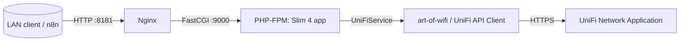
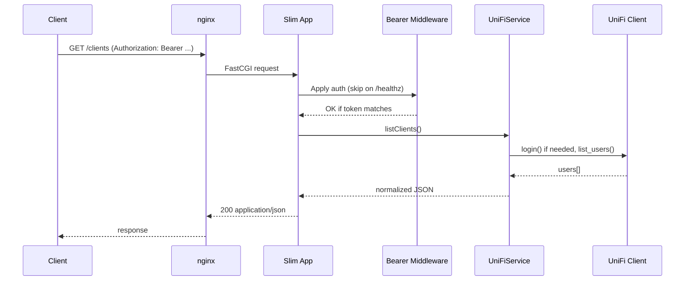

## UniFi API Service (Dockerized Slim 4 + nginx)

This directory contains a production-ready REST API that wraps the UniFi PHP client. It runs as a PHP-FPM service behind nginx and is designed to be reachable from your LAN on port 8181 and by other containers (e.g., n8n) via a shared Docker network.

### Highlights
- Authorization: Bearer <token> required for all routes except /healthz
- Routes:
  - GET /healthz → liveness check (no auth)
  - GET /clients → normalized clients list
  - PUT /clients/{mac}/alias → set a user-friendly alias
- Uses `art-of-wifi/unifi-api-client` under the hood and supports classic controllers and UniFi OS consoles.

### High-level architecture



### Slim app internals



### Project layout

```
api/
  composer.json
  Dockerfile
  nginx/
    default.conf
  public/
    index.php
  src/
    Middleware/
      BearerAuthMiddleware.php
    UniFi/
      UniFiService.php
```

### Configuration (environment)

Set the following variables (via docker-compose `environment`, `.env`, or your orchestrator):

- API_BEARER_TOKEN: shared secret for Bearer auth
- UNIFI_BASE: e.g., https://unifi.example.com or https://host:8443
- UNIFI_SITE: `default` unless specified
- UNIFI_VERSION: defaults to `9.0.0`
- UNIFI_USER / UNIFI_PASS: local admin account (no MFA/SSO)
- UNIFI_VERIFY_SSL: `true` (recommended in production) or `false`

### Running with Docker Compose

From repository root:

```
docker compose build
docker compose up -d
```

The nginx service exposes port 8181 on the host:

```
curl -s http://localhost:8181/healthz
```

If you have an external Docker network named `neuralnoc`, the services will join it by default. Otherwise, comment the `neuralnoc` lines and use a local `sharednet` in `docker-compose.yml`, then ensure dependent services (e.g., n8n) also join the same network.

### Security model

- All non-health endpoints require `Authorization: Bearer <API_BEARER_TOKEN>`.
- For UniFi OS consoles, the client automatically handles CSRF headers and uses `/proxy/network` paths.
- Cookies/tokens are managed by the client and re-login is performed once automatically on 401.

### API reference (this service)

- GET /healthz
  - Returns `{ "ok": true }`
  - No auth required

- GET /clients
  - Requires Bearer token
  - Returns normalized array of clients:
    - `id`, `mac`, `ip`, `name`, `hostname`, `note`

- PUT /clients/{mac}/alias
  - Requires Bearer token
  - JSON body: `{ "alias": "New Name" }`
  - Returns `{ "updated": true|false }`

### Troubleshooting

- 401 Unauthorized: verify `API_BEARER_TOKEN` matches and header is `Authorization: Bearer <token>`
- 500 errors: check container logs (`docker compose logs -f api nginx`), verify UniFi connectivity and credentials.
- SSL: set `UNIFI_VERIFY_SSL=false` only for testing; enable it for production with a valid certificate matching the hostname.


